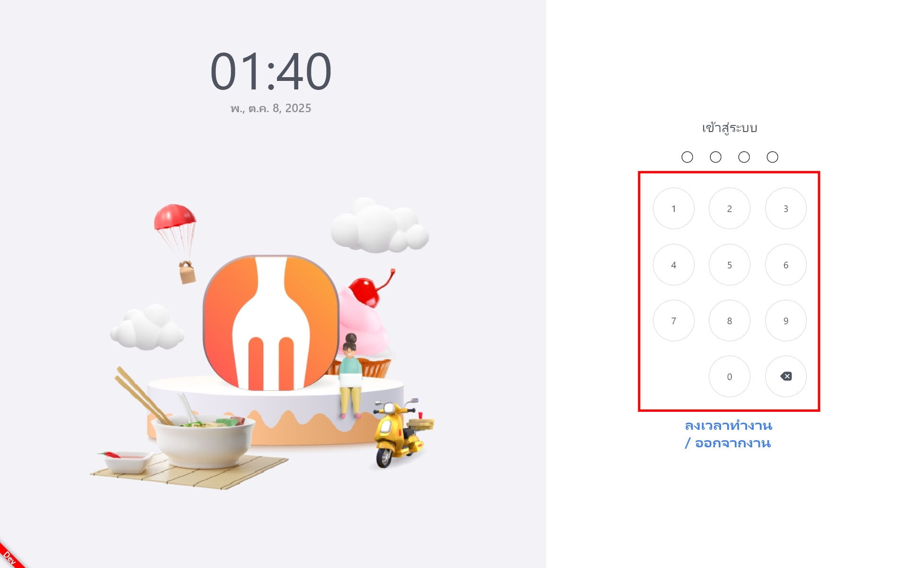
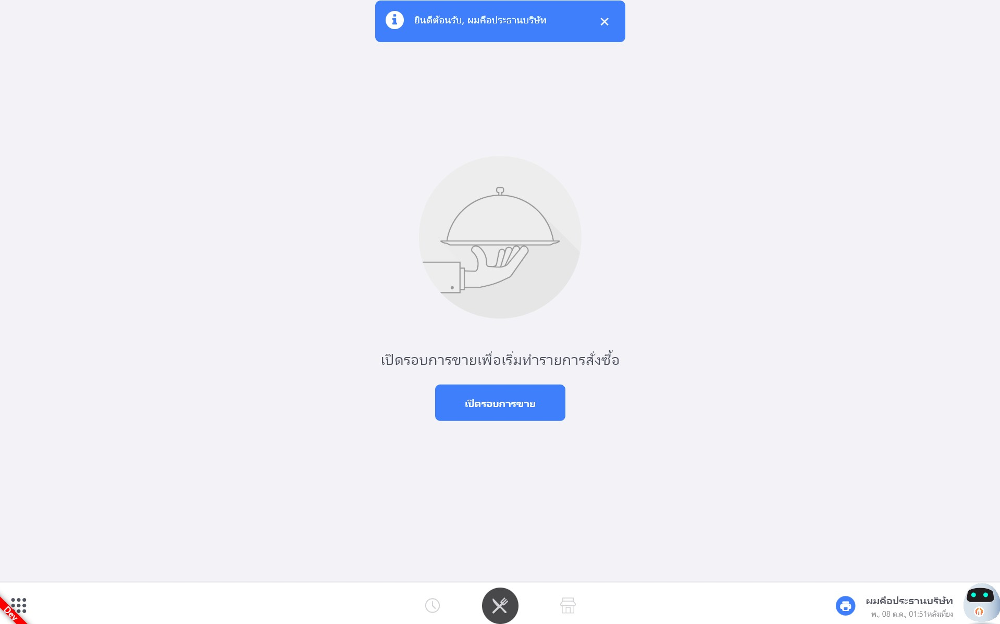
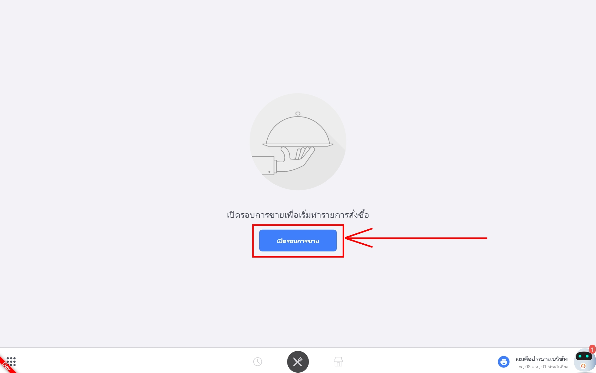
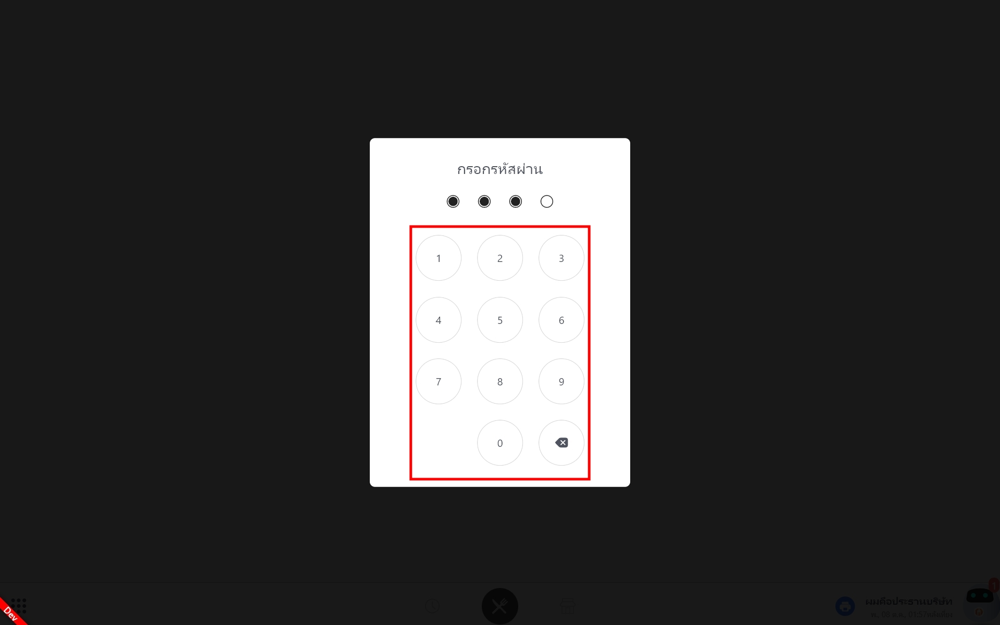
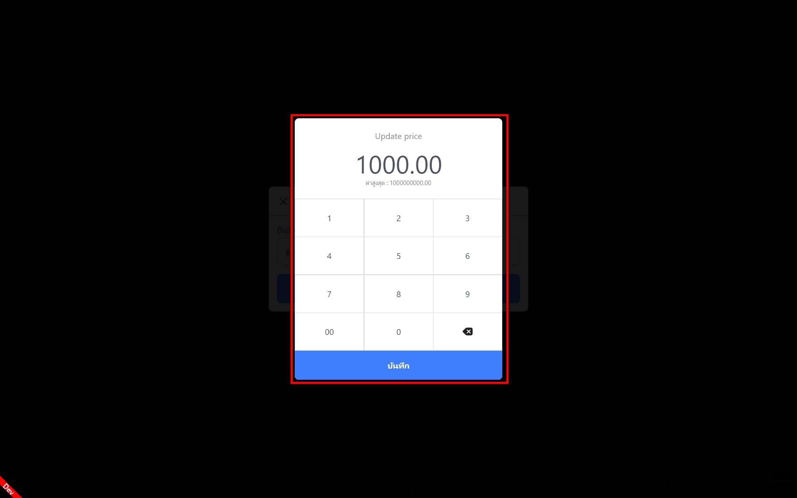
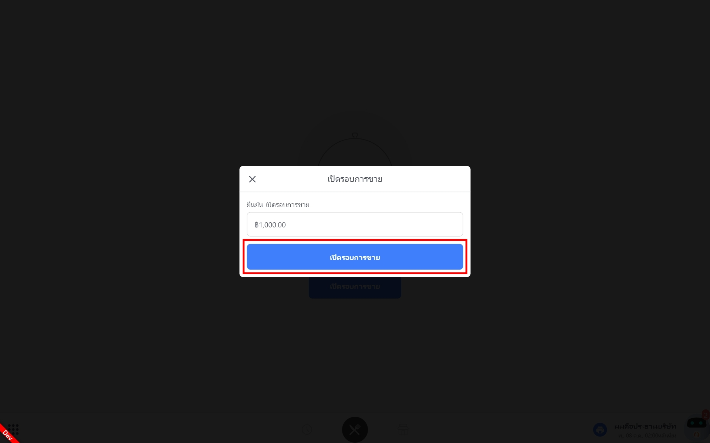
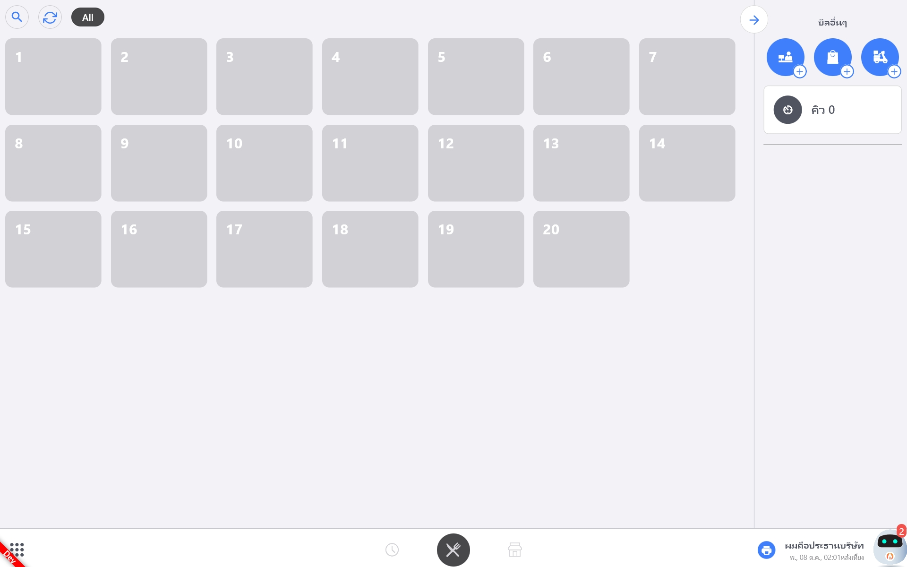
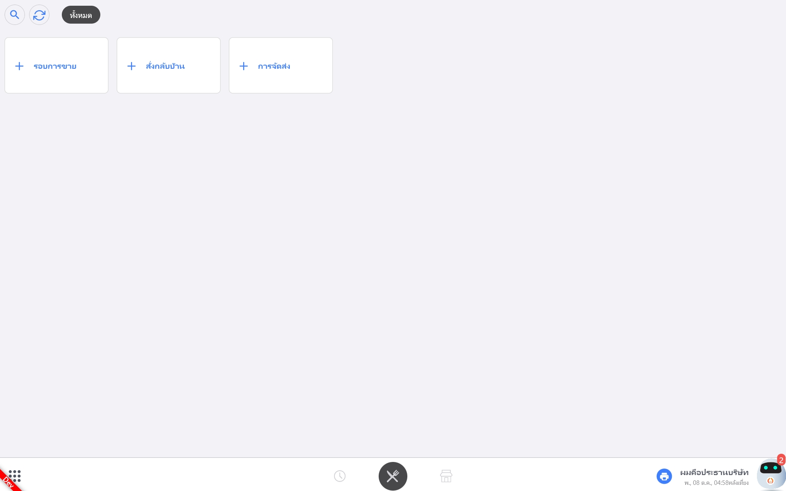
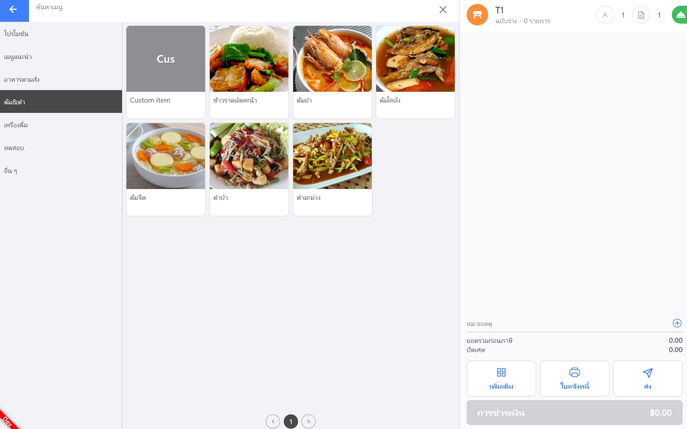

# วิธีการใช้งานระบบหน้าบ้าน

*สวัสดีครับ วันนี้ แอดมินก็จะมาสอนการใช้งานระบบหน้าบ้านของ Feedme POS กันนะครับ โดยต้องขอบอกไว้ก่อนนะครับว่า ระบบ Feedme POS ของเรา แยกเป็น หน้าบ้านกับหลังบ้านนะครับ*  
<h3>ระบบหน้าบ้าน</h3> 

---
## ลงเวลาทำงาน

พนักงานสามารถกดปุ่ม “ลงเวลาทำงาน / ออกจากงาน” เพื่อบันทึกเวลาเข้าและออกงานได้อย่างสะดวก ข้อมูลทั้งหมดจะถูกส่งไปเก็บไว้ในระบบหลังบ้านโดยอัตโนมัติ

ก่อนลงเวลาเข้างาน พนักงานต้องกดรหัส PIN ส่วนตัว 4 หลักเพื่อยืนยันตัวตน

กดปุ่ม <b>“ลงเวลาทำงาน”</b> เพื่อบันทึกเวลาเข้างาน

เมื่อพนักงานลงเวลาทำงานเรียบร้อย ระบบจะเริ่มนับเวลาทำงานตั้งแต่ 0 ชั่วโมง 0 นาที และจะเพิ่มขึ้นเรื่อย ๆ ตามเวลาจริงที่ทำงาน
 
*หากต้องการออกจากหน้านี้ ให้แตะที่ หน้าจอสีดำด้านข้างกรอบลงเวลาทำงาน ระบบจะพากลับไปยังหน้าแรกโดยอัตโนมัติ*

## วิธีการเปิดรอบการขาย

- ใส่รหัส PIN 4 หลักของพนักงาน เช่น PIN: 0001 เพื่อยืนยันตัวตน
- เมื่อเข้าสู่หน้าการขาย ระบบจะแสดง Popup ด้านบนแจ้งชื่อพนักงานที่ล็อกอินเข้ามา
- ที่มุมขวาล่างของหน้าจอ (ตรงไอคอนรูปหุ่นยนต์) จะปรากฏชื่อพนักงานคนนั้นด้วยเช่นกัน

- กดปุ่ม <b>“เปิดรอบการขาย”</b>
- ใส่รหัส PIN 4 หลักของพนักงานที่รับผิดชอบการเปิดรอบ
- ระบุจำนวนเงินสดที่มีอยู่ในลิ้นชักตอนเริ่มต้น เช่น หากมีเงินสด 1,000 บาท ให้กรอกจำนวนนี้ลงในช่องที่กำหนด เพื่อให้ระบบบันทึกยอดเริ่มต้นอย่างถูกต้อ

กดปุ่ม <b>“เปิดรอบการขาย”</b> เพื่อเข้าสู่ระบบหน้าการขายโดยตรง
หลังจากนั้น ระบบจะแสดงหน้าการขายขึ้นมา พร้อมให้เริ่มทำรายการได้ทันที

## วิธีการสั่งอาหาร

สำหรับผู้ใช้โหมด <b>ชำระเงินก่อนทาน</b> หน้าจอของคุณจะมีหน้าตาแบบนี้:
คุณสามารถเลือกวิธีการสั่งอาหารได้โดยตรง เช่น สั่งที่เคาน์เตอร์ / สั่งกลับบ้าน / การจัดส่ง (เช่น FeedMe Express, Grab, FoodPanda เป็นต้น)

สำหรับผู้ใช้โหมด <b>ชำระเงินทีหลัง</b> หน้านี้จะเป็นหน้าหลักสำหรับการสั่งอาหาร โดยด้านซ้ายจะแสดงโต๊ะในร้านของคุณ ส่วนด้านขวาคือ “บิลอื่น ๆ”
เมื่อมีลูกค้าเข้ามา ให้คลิกที่โต๊ะที่ลูกค้านั่งเพื่อเริ่มการสั่งอาหารครับ 
  - 🍽️ เริ่มต้นการสั่งออเดอร์
ในขั้นตอนแรก ผู้ใช้สามารถ คลิกที่หมายเลขโต๊ะ ที่ต้องการ เพื่อเริ่มต้นการสั่งออเดอร์ได้ทันที ระบบจะพาเข้าสู่หน้าการสั่งอาหารของโต๊ะนั้นโดยอัตโนมัติ เช่นคลิกที่ <b>"T1"</b> เพื่อทำการเปิดโต๊ะ

🧾 <b>ขั้นตอนการสั่งอาหารจากหน้าการขาย</b>
- เลือกหมวดหมู่ที่ต้องการ เช่น อาหารจานหลัก เครื่องดื่ม หรือของหวาน
- จากนั้นเลือกชื่อเมนูที่ต้องการสั่งจากรายการที่แสดงบนหน้าจอ

## การจัดการโต๊ะ

*หน้าจอจัดการโต๊ะ สามารถดูสถานะโต๊ะว่าง / จอง / กำลังใช้งานได้*
