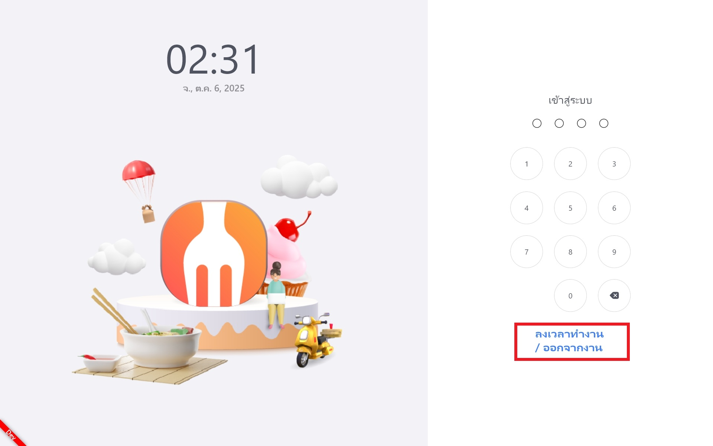
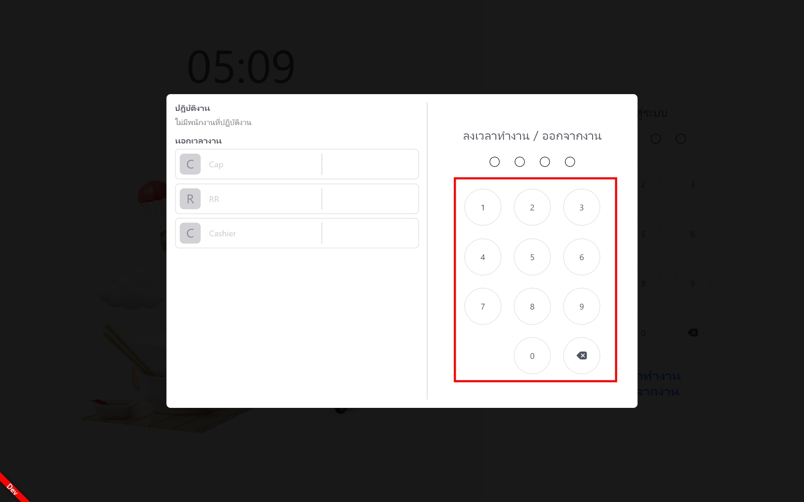
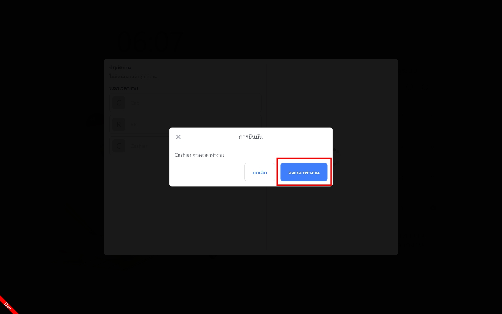
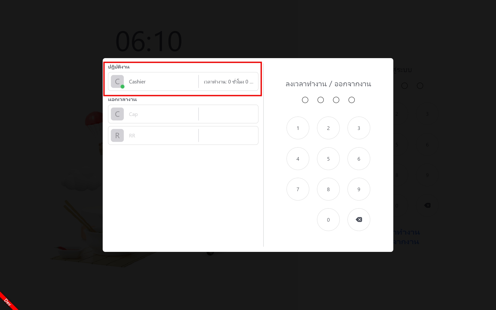

# วิธีการใช้งานระบบหน้าบ้าน

*สวัสดีครับ วันนี้ แอดมินก็จะมาสอนการใช้งานระบบหน้าบ้านของ Feedme POS กันนะครับ โดยต้องขอบอกไว้ก่อนนะครับว่า ระบบ Feedme POS ของเรา แยกเป็น หน้าบ้านกับหลังบ้านนะครับ*  
<h3>ระบบหน้าบ้าน</h3> 

---
## ลงเวลาทำงาน

หน้าหลักล็อกอินของ FeedMe POS : พนักงานสามารถกดที่ "ลงเวลาทำงาน / ออกจากงาน" เพื่อลงเวลาทำงานและลงเวลาออกงานได้ ข้อมูลดังกล่าวจะถูกเก็บไว้ที่ระบบหลังบ้าน

ให้ทำการกดเลข PIN 4 ตัว ของพนักงานเพื่อทำการลงเวลาเข้างาน

ทำการกดปุ่ม "ลงเวลาทำงาน" เพื่อสแตมป์เวลาที่เข้างาน

เมื่อทำการลงเวลาทำงานสำเร็จแล้วระบบจะเริ่มจับเวลาตั้งแต่ 0 ชั่วโมง 0 นาที และจะเพิ่มเวลาไปเรื่อย ๆ ตามจำนวนจริง  
*หากต้องการออกจากหน้านี้ใหห้กดที่หน้าจอสีดำด้านข้างกรอบลงเวลาทำงาน เพื่อกลับไปยังหน้าแรก*

## วิธีการเปิดรอบการขาย

  <video autoplay loop muted playsinline width="auto">
    <source src="../videos/วิธีเข้าสู่รอบการขาย.mp4" type="video/mp4">
    Your browser does not support the video tag.
  </video>
  
ทำการใส่เลข PIN 4 ตัวของตัวเองเพื่อเข้าสู่หน้าการขาย เช่น หาก PIN: 1111 ก็ให้กดที่ตัวเลขนั้น ๆ และเข้าสู่รอบการขายเลย

## การสั่งอาหาร

*ตัวอย่างหน้าการสั่งอาหาร พร้อมปุ่มฟังก์ชันต่าง ๆ*

---

## การจัดการโต๊ะ

*หน้าจอจัดการโต๊ะ สามารถดูสถานะโต๊ะว่าง / จอง / กำลังใช้งานได้*
